[TOC]


# 製作Ubuntu 開機隨身碟


## 下載Ubuntu 20.04

Download URL: http://www.ubuntu-tw.org/modules/tinyd0/


## 下載rufus (製作開機隨身碟工具)

Download URL: https://rufus.ie/en/

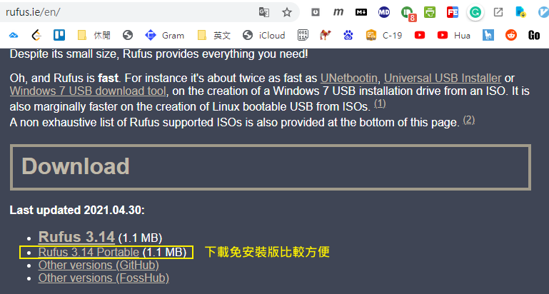


Step1. 選擇 iso檔 

PS: 2T以下選MBR （檔案會比較單純。）

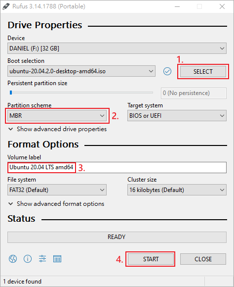


Step2. 選擇ISO image mode

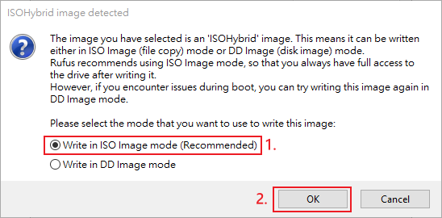


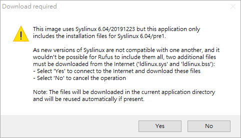


# 安裝Ubuntu 20.04 (缺截圖)


## ZenBook UX425UA 進入Bios (R7 5700u)

關機狀態下按住F2後，按開機鍵。


# Install development tools(Build ChromeOS Tool)


## 安裝開發工具 （安裝於Ubuntu）

- git

- curl

- python3

- py3 virtual env

  

```shell
#安裝開發工具 （安裝於Ubuntu）     
sudo apt-get update

sudo apt-get upgrade

sudo apt-get install git-core gitk git-gui curl lvm2 thin-provisioning-tools python3-pkg-resources python3-virtualenv python3-oauth2client xz-utils -y
```


升级到python3.6（若系统为20.4，不需要以下步驟）

```shell
#升级到python3.6（若系统为20.4，不需要更新python）
sudo apt-get install software-properties-common -y

sudo add-apt-repository ppa:deadsnakes/ppa
sudo apt-get update
sudo apt-get install python3.6 -y

sudo update-alternatives --install /usr/bin/python3 python3 /usr/bin/python3.5 1
sudo update-alternatives --install /usr/bin/python3 python3 /usr/bin/python3.6 2

python3 --version
sudo update-alternatives --config python3
```


## Configure git  （mail & Name）


第一次使用git 須配置mail & Name：

```shell
git config --global user.email "you@example.com"  
git config --global user.name "Your Name"
```


```shell
#帳號：pengjunhao5@huaqin.corp-partner.google.com
#密码：p+h

git config --global user.name "pengjunhao5"
git config --global user.email "pengjunhao5@huaqin.corp-partner.google.com"
git config --global core.autocrlf false
git config --global core.filemode false
git config --global color.ui true
```


PS: 附上Ivan的帳號

```shell
#帳號：liyingxi@huaqin.corp-partner.google.com
#密码：Aa8246123

git config --global user.name "liyingxi"
git config --global user.email "liyingxi@huaqin.corp-partner.google.com"
git config --global core.autocrlf false
git config --global core.filemode false
git config --global color.ui true
```


PS: 附上wufenxia(粉霞)的帳號

```shell
#帳號：wufenxia@huaqin.corp-partner.google.com
#密码：13461664433.W  

git config --global user.email "wufenxia@huaqin.corp-partner.google.com " 
git config --global user.name "wufenxia"
git config --global core.autocrlf false
git config --global core.filemode false
git config --global color.ui true
```


[Google Acount]

```Bat
# 粉霞 Google Acount
帳號：wufenxia@huaqin.corp-partner.google.com
密码：13461664433.W  
```

PS: 這個帳號可以用來登陸Google gerrit

```Bat
# Ivan Google Acount
帳號：liyingxi@huaqin.corp-partner.google.com
密码：Aa8246123
```

```shell
# Daniel Google Acount
帳號：pengjunhao5@huaqin.corp-partner.google.com
密码：p+h
```


我的配置：

```shell
# Daniel's Setting
git config --global user.email "pengjunhao5@huaqin.com"  
git config --global user.name "Daniel"
git config --global core.autocrlf false
git config --global core.filemode false
git config --global color.ui true
```


## 調整 sudoers 配置


## Set locale

```
$ sudo apt-get install locales
$ sudo dpkg-reconfigure locales
```

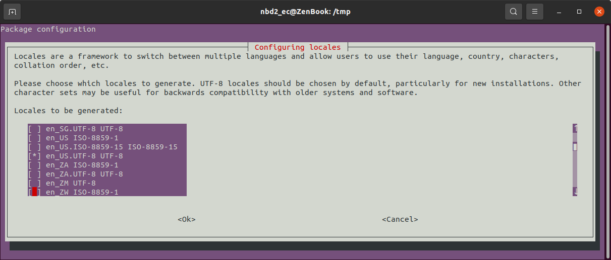

PS: 用Tab切換OK。

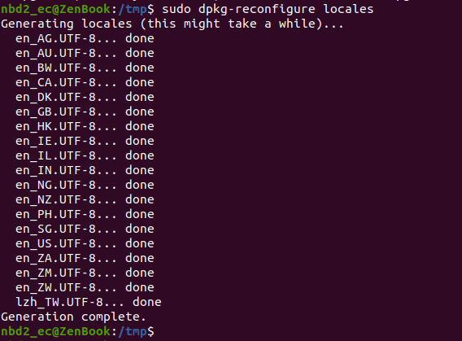


執行結束後需要登出在登錄才會生效。


## 再次確認當前平台為64位元

```shell
uname -m
```


## 設定權限

```shell
#每次重Build前要檢查一下
umask 022
```

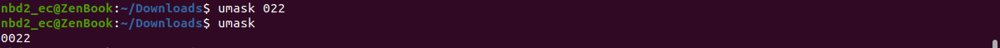


## 安裝 depot_tools

安裝這一步的目的是為了讓你的電腦可以使用repo cmd 以及後續可以使用get/sync


- 安裝depot_tools參考連結

URL: https://commondatastorage.googleapis.com/chrome-infra-docs/flat/depot_tools/docs/html/depot_tools_tutorial.html#_setting_up


```shell
# 安裝 depot_tools 步驟
sudo mkdir /path
sudo mkdir /path/to
cd /path/to

# Clone depot_tools 儲存庫
sudo git clone https://chromium.googlesource.com/chromium/tools/depot_tools.git

#修改bashrc
gedit ~/.bashrc

#--------------  修改至.bashrc

#增添權限 & depot_tools環境變數 
umask 022

# 更改環境變數 (如果你有使用其他Bash，你可能會想添加在~/.bashrc or ~/.zshrc裡面, 不然每次重開機都要打很麻煩...）
# 這邊假設你希望 depot_tools 放在路徑： /path/to/depot_tools: (路徑你可以自己選你喜歡的。)
export PATH=/path/to/depot_tools:$PATH

#--------------


source ~/.bashrc
```


重新載入Bash

```
source ~/.bashrc
```


- 環境變數 Path 截圖

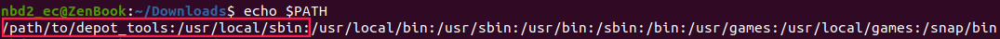


## Prepare


```shell
cd /tmp

cat > ./sudo_editor <<EOF
#!/bin/sh
echo Defaults \!tty_tickets > \$1         
echo Defaults timestamp_timeout=180 >> \$1 
EOF
chmod +x ./sudo_editor
sudo EDITOR=./sudo_editor visudo -f /etc/sudoers.d/relax_requirements
```

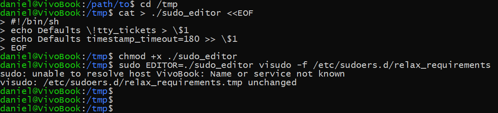


## 下載源碼 （chromium os）

預設放在家目錄下 路徑： ~/chromiumos （可以依自己需要修改）

```shell
mkdir -p ~/ch
cd ~/ch
repo init -u https://chromium.googlesource.com/chromiumos/manifest.git --repo-url https://chromium.googlesource.com/external/repo.git
repo sync -j16
```

PS： 這邊一定要確保depot_tools正確安裝。


PS: 補充可能會重複用到的命令

```shell
cd ~
rm -r -f ~/ch
mkdir -p ~/ch
repo init -u https://chromium.googlesource.com/chromiumos/manifest.git --repo-url https://chromium.googlesource.com/external/repo.git
repo sync -j16
```

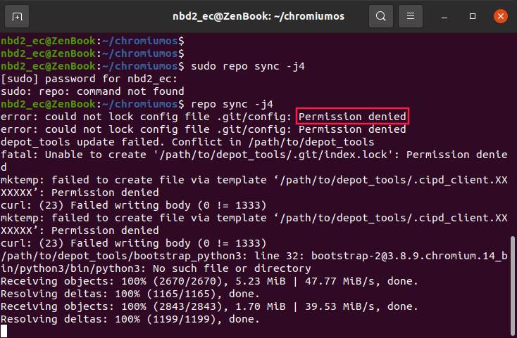


## 編譯


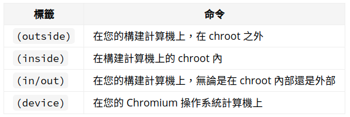

```
(outside) cros_sdk
(cr) cd ~/trunk/src/scripts
(cr) export BOARD=strongbad
(cr) setup_board --board=${BOARD}
```

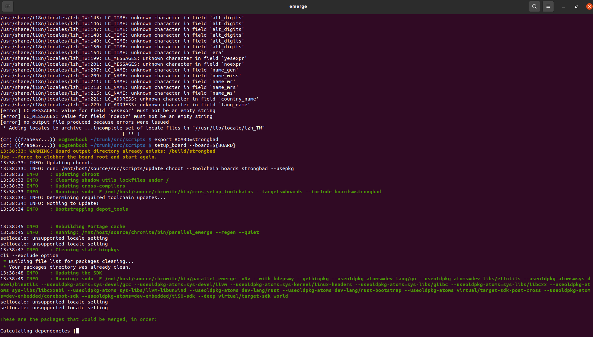


## Build EC 編譯環境

```shell
cros_sdk --no-ns-pid

cd ~/trunk/src/platform/ec
cros_workon-strongbad start chromeos-ec
make -j BOARD=coachz
```


### Build EC 命令

```shell
emerge-strongbad chromeos-ec
```

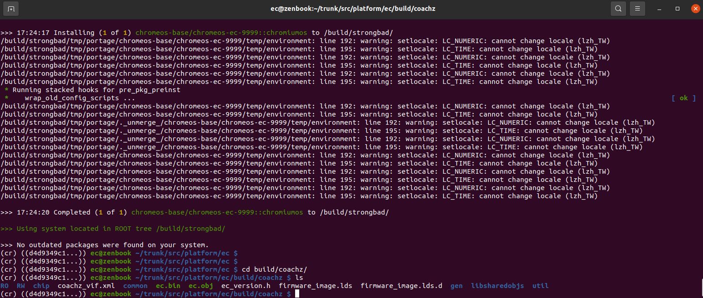


## 燒錄EC

開啟另一終端

```shell
sudo servod -b strongbad &
flash_ec --board coachz --image=./ec.bin
```

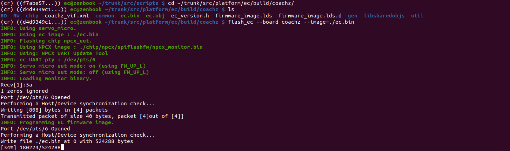


#### 遇到的雷 Connect refuse

如果在

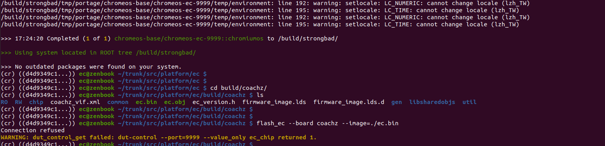


### 建立BSP編譯環境

```shell
cros_sdk –no-ns-pid
cros-workon-strongbad start coreboot
emerge-strongbad chromeos-config chromeos-config-bsp-strongbad chromeos-config-bsp-strongbad-private chromeos-bmpblk sc7180-qc_blobs libpayload depthcharge coreboot chromeos-bootimage

```


## CCD

- Case Closed Debugging (CCD)  ->  一套chrome 用來debug的工具。


### 安裝 Chrome OS Hardware Debug & Control Tools)

```Cr
(cr) sudo emerge hdctools
```


### 安裝minicom

Chroot  環境下的UART

```Cr
(cr) sudo emerge minicom
```


# 相關連結

1. 開發文檔連結

   URL: https://chromium.googlesource.com/chromiumos/docs/+/master/developer_guide.md

2. 安裝depot_tools參考連結

   URL: https://commondatastorage.googleapis.com/chrome-infra-docs/flat/depot_tools/docs/html/depot_tools_tutorial.html#_setting_up

   


# 相關檔案(留存備份)


### deepin screenshot

1. 下載URL or 命令 :

   ```shell
   sudo apt-get update -y
   sudo apt-get install -y deepin-screenshot
   ```

2. 說明文件URL : 


### 7z

1. 下載URL or 命令 :

   ```shell
   #Install 7z
   sudo 7z a ~/depot_tools.7z depot_tools/
   #壓縮檔案
   sudo 7z a ~/depot_tools.7z depot_tools/
   #解壓縮檔案
   sudo 7z e filename
   ```

2. 說明文件URL : 
